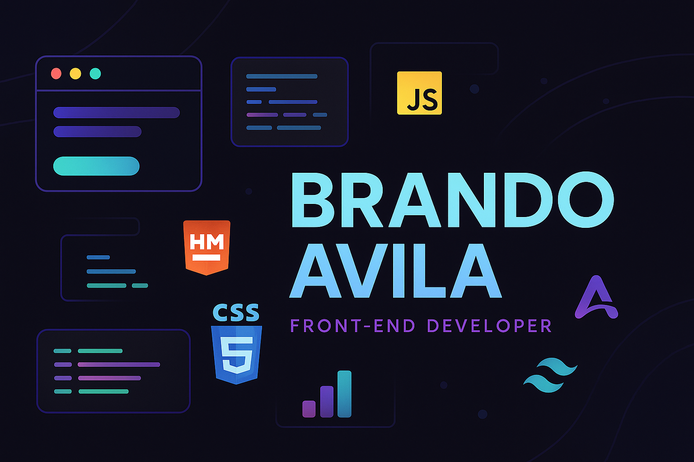

## 👋¡Hola! Soy Brando Avila

Soy estudiante de Desarrollo y Gestión de Software y me encanta crear cosas con código.  
Principalmente me enfoco en **Frontend**, pero también estoy metiéndome al **Backend** con Java, Spring Boot y un poco de Node.js + Express.

### ⚙️ Tecnologías que uso
- **Frontend:** HTML, CSS, JavaScript, Astro, TailwindCSS
- **Backend:** Node.js, Express, Java, Spring Boot
- **Herramientas:** Git, GitHub, Figma

### GitHub Stats

Gracias por pasar por aquí 🙌  
¡Siempre abierto a aprender, compartir y colaborar!
